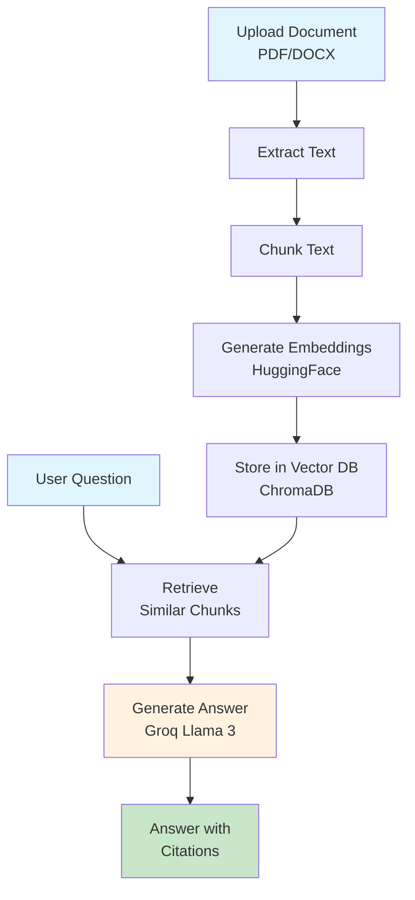
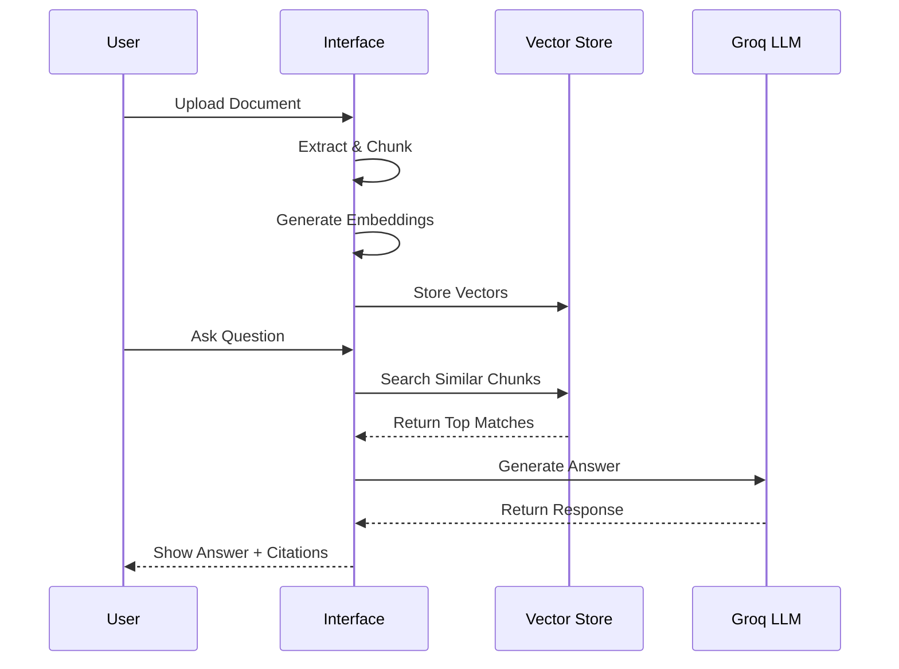

# Lexi Bot

**AI-Powered Legal Document Analysis with RAG**

[](https://opensource.org/licenses/MIT)
[](https://www.python.org/downloads/)

Lexi Bot is a legal document assistant that uses RAG (Retrieval-Augmented Generation) to analyze legal documents and answer questions with citations. Built with open-source AI tools.

---

## Why "Lexi"?

**Lexi** comes from the Latin word *"Lex"* meaning **law**.

**Lexi** = **Lex** (Law) + **AI** (Artificial Intelligence)

The name reflects the project's focus on legal document analysis using AI-powered RAG technology.

---

## Features

- **Document Upload** - PDF and DOCX support
- **Semantic Search** - Vector-based retrieval using embeddings
- **Natural Language Q&A** - Ask questions in plain English
- **Cited Answers** - Responses with source references
- **Legal-Specific Features** - Citation extraction, clause classification, entity recognition

---

## Architecture



### RAG Pipeline Flow



---

## Tech Stack

| Component | Technology |
|-----------|------------|
| **Framework** | LlamaIndex |
| **Document Loaders** | PDF/DOCX parsers |
| **Embeddings** | HuggingFace (all-MiniLM-L6-v2) |
| **Vector DB** | ChromaDB (+ Qdrant for dashboard) |
| **LLM** | Groq API (Llama 3) |
| **Deployment** | Docker |

---

## Environment Setup

### 1. Create Environment File

```bash
# Copy the example environment file
cp .env.example .env
```

### 2. Configure API Keys

Edit `.env` and add your Groq API key:

```env
GROQ_API_KEY=your_actual_api_key_here
QDRANT_URL=http://localhost:6333
```

**Get Groq API Key:**
1. Visit https://console.groq.com/keys
2. Sign up or log in
3. Create a new API key (free tier available)
4. Paste into `.env`

**Free Tier Limits:**
- Llama 3: 14,400 requests/day
- Mixtral: 1,440 requests/day

---

## Project Structure

```
lexi-bot/
├── notebooks/          # Jupyter notebooks (prototypes)
├── data/               # Sample legal documents
│   ├── pdf/
│   ├── docx/
│   └── txt/
├── docs/               # Documentation guides
├── scripts/            # Utility scripts (migration, etc.)
├── docker-compose.yml  # ChromaDB & Qdrant services
├── Dockerfile
├── requirements.txt    # Python dependencies
├── .env.example        # Environment variables template
└── README.md           # This file
```

---

## Learning Flow

This project follows a **notebook-first approach**: prototype in Jupyter, then refactor to production code.

```mermaid
flowchart LR
    A[Notebook Prototypes] --> B[MVP Prototype]

    subgraph A[Phase 1: Notebooks]
        A1[1. Document Loading]
        A2[2. Text Chunking]
        A3[3. Metadata Extraction]
        A4[4. Embeddings]
        A5[5. Vector Store]
        A6[6. Groq LLM Integration]
        A7[7. Prompt Engineering]
        A8[8. Full Pipeline]
    end

    subgraph B[Phase 2: Production]
        B1[src/ modules]
        B2[Streamlit App]
    end

    style A1 fill:#c8e6c9
    style A2 fill:#c8e6c9
    style A3 fill:#c8e6c9
    style A4 fill:#c8e6c9
    style A5 fill:#c8e6c9
    style A6 fill:#c8e6c9
    style A7 fill:#c8e6c9
    style A8 fill:#fff9c4
```



---

### Current Status

**Completed Notebooks:**
1. **Document Loading** - Load PDF and DOCX files, extract text and metadata
2. **Text Chunking** - Split documents into manageable chunks
3. **Metadata Extraction** - Extract structured information from documents
4. **Embeddings** - Generate vector representations using HuggingFace
5. **Vector Store** - Store and query vectors with ChromaDB (+ Qdrant for visualization)
6. **Groq LLM Integration** - Connect to Groq API, streaming responses, RAG with context
7. **Prompt Engineering** - Legal-specific prompt templates, chain-of-thought, few-shot examples

**Next Steps:**
8. Full RAG Pipeline - End-to-end question answering
9. Evaluation - Test answer quality and relevance

After completing the notebooks, the code will be refactored into production modules under `src/`.

---

> **Disclaimer**: This is an educational project. Do not use for actual legal advice or critical legal work.
